# AWS EC2 Auto Scaling Web Server

> A hands-on AWS project demonstrating automated EC2 web-server provisioning, Auto Scaling Group capacity management, CloudWatch-based target tracking, horizontal scale-out, and scale-in.

[](https://aws.amazon.com/)
[](https://aws.amazon.com/ec2/)
[](https://aws.amazon.com/cloudwatch/)
[](https://httpd.apache.org/)

---

## 📌 Project Overview

This project implements an **EC2 Auto Scaling environment on AWS** in which web-server instances are provisioned automatically from an EC2 Launch Template and managed by an Auto Scaling Group (ASG).

The implementation demonstrates the complete lifecycle requested by the project:

**Launch Template → Automated Web Server Deployment → Auto Scaling Group → CloudWatch CPU Metric → Target Tracking → Scale-Out → Scale-In**

Each newly launched EC2 instance is configured automatically using **EC2 User Data**. Apache HTTP Server is installed during instance initialization, and the web page displays the instance ID so that different instances can be distinguished during testing.

The scaling test uses a **Target Tracking Scaling Policy** based on **Average CPU Utilization**.

---

## 🎯 Objectives

The project was built to demonstrate:

- Creation of an EC2 Launch Template.
- Automated web-server installation using EC2 User Data.
- Creation of an EC2 Auto Scaling Group.
- Configuration of minimum, desired, and maximum capacity.
- Monitoring of EC2 CPU utilization.
- Configuration of a Target Tracking scaling policy.
- Demonstration of horizontal scale-out.
- Demonstration of horizontal scale-in.
- Verification that a newly launched instance is automatically configured as a web server.
- Collection of AWS Console screenshots as implementation evidence.

---

## 🏗️ Architecture

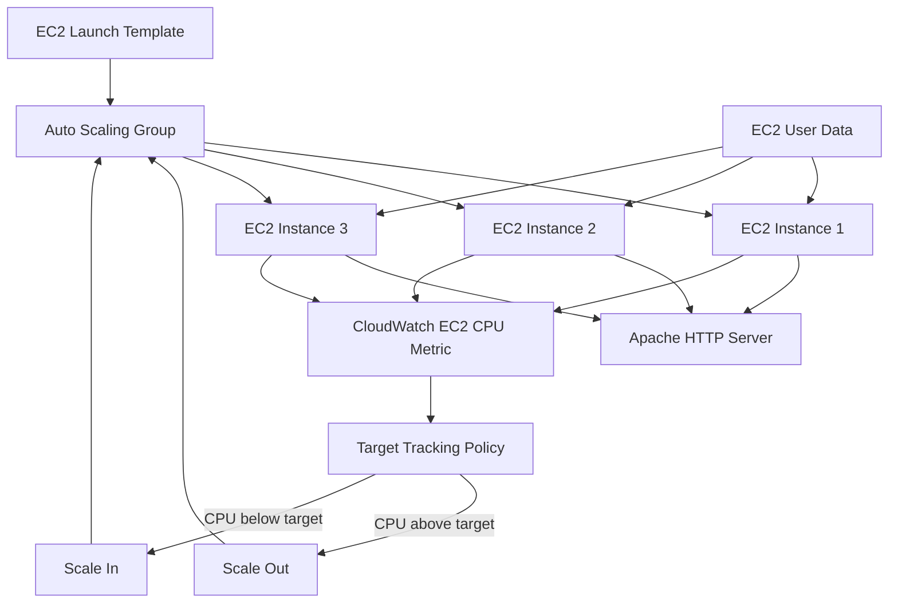

### Logical flow

```text
                    ┌──────────────────────────┐
                    │     Launch Template      │
                    │ AMI + t3.micro + User   │
                    │ Data + Security Group   │
                    └────────────┬─────────────┘
                                 │
                                 ▼
                    ┌──────────────────────────┐
                    │   Auto Scaling Group     │
                    │   Min: 1 | Desired: 2   │
                    │   Max: 3                 │
                    └────────────┬─────────────┘
                                 │
              ┌──────────────────┼──────────────────┐
              ▼                  ▼                  ▼
          EC2 #1              EC2 #2              EC2 #3
          Apache              Apache              Apache
              │                  │                  │
              └──────────────────┼──────────────────┘
                                 ▼
                     CloudWatch CPU Metrics
                                 │
                                 ▼
                    Target Tracking Policy
                       ┌─────────┴─────────┐
                       ▼                   ▼
                   Scale Out           Scale In
```

> **Scope:** This implementation focuses on the EC2 Launch Template + Auto Scaling Group + CloudWatch/Target Tracking workflow. An Application Load Balancer is not part of this implementation.

---

## ☁️ AWS Services and Components

| Component | Purpose |
|---|---|
| **Amazon EC2** | Hosts the web-server instances |
| **EC2 Launch Template** | Defines the configuration used for new EC2 instances |
| **EC2 Auto Scaling Group** | Maintains and adjusts the EC2 instance capacity |
| **Amazon CloudWatch** | Provides monitoring metrics such as CPU utilization |
| **Target Tracking Policy** | Adjusts ASG desired capacity toward the configured CPU target |
| **Security Group** | Controls network access to the EC2 instances |
| **EC2 User Data** | Automates initial server configuration |
| **Apache HTTP Server** | Serves the test web page |

---

## ⚙️ Environment Configuration

| Setting | Project Value |
|---|---|
| AWS Region | `us-east-1` — US East (N. Virginia) |
| Launch Template | `autoscaling-web-template` |
| Auto Scaling Group | `autoscaling-web-asg` |
| Instance Type | `t3.micro` |
| AMI | Amazon Linux 2023 |
| Web Server | Apache HTTP Server (`httpd`) |
| Scaling Method | Target Tracking |
| Scaling Metric | Average CPU Utilization |
| CPU Target | `50%` |
| Minimum Capacity | `1` |
| Desired Capacity | `2` |
| Maximum Capacity | `3` |
| Instance Warmup | `300` seconds |

> These values are taken from the AWS Console evidence included in this repository.

---

# 1. 🌎 AWS Region

The project was implemented in:

```text
Region Name : US East (N. Virginia)
Region Code : us-east-1
```

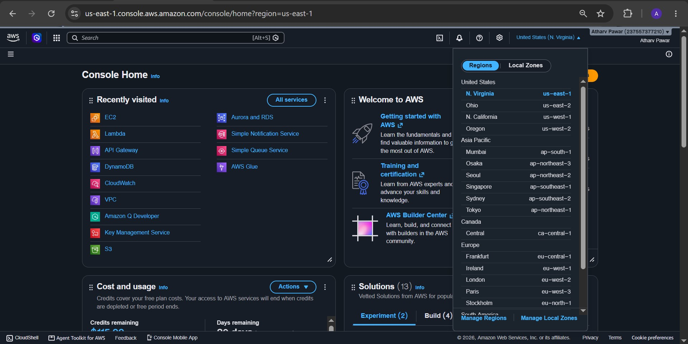

---

# 2. 🔐 Security Group

The web-server environment uses the security group:

```text
autoscaling-web-sg
```

The security group provides the network access required for testing the HTTP web server.

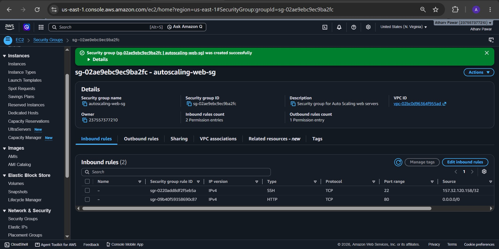

### Security consideration

For a production deployment:

- Allow only the ports that are actually required.
- Restrict source CIDRs where possible.
- Avoid exposing SSH (`22`) to `0.0.0.0/0` unless there is a justified operational requirement.
- Prefer private subnets and controlled access for application instances in production architectures.

---

# 3. 🚀 EC2 Launch Template

The Launch Template is the reusable instance definition used by the Auto Scaling Group.

```text
Launch Template
└── autoscaling-web-template
```

The project Launch Template uses:

- Amazon Linux 2023
- `t3.micro`
- `autoscaling-web-sg`
- 8 GiB root volume
- EC2 User Data for automated Apache installation

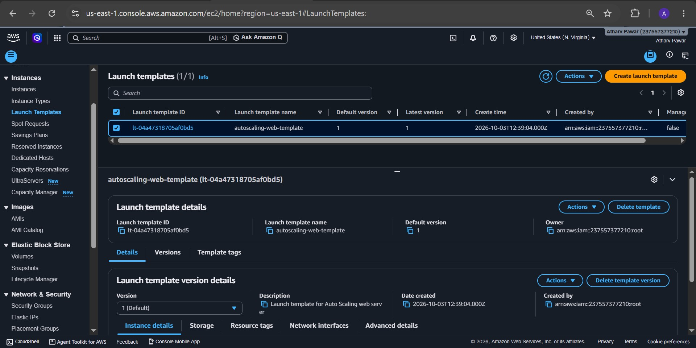

---

# 4. 📝 EC2 User Data — Automated Web Server Deployment

The web server is deployed automatically when an EC2 instance starts.

The User Data process:

1. Updates the system packages.
2. Installs Apache HTTP Server.
3. Enables Apache at boot.
4. Starts Apache.
5. Requests an IMDSv2 token.
6. Retrieves the EC2 instance ID.
7. Creates an HTML page showing the instance ID.

### User Data

```bash
#!/bin/bash

dnf update -y
dnf install -y httpd

systemctl enable httpd
systemctl start httpd

TOKEN=$(curl -X PUT "http://169.254.169.254/latest/api/token" \
-H "X-aws-ec2-metadata-token-ttl-seconds: 21600")

INSTANCE_ID=$(curl -s \
-H "X-aws-ec2-metadata-token: $TOKEN" \
http://169.254.169.254/latest/meta-data/instance-id)

cat <<EOF > /var/www/html/index.html
<!DOCTYPE html>
<html>
<head>
    <title>AWS Auto Scaling Web Server</title>
</head>
<body>
    <h1>AWS Auto Scaling Web Server</h1>
    <h2>Auto Scaling is working!</h2>
    <p><strong>Instance ID:</strong> $INSTANCE_ID</p>
    <p>Apache Web Server installed automatically using User Data.</p>
</body>
</html>
EOF
```

### Why the instance ID is displayed

Displaying the instance ID makes it easy to verify that different EC2 instances were created and configured independently by the Auto Scaling Group.

### IMDSv2

The script uses the EC2 Instance Metadata Service v2 token flow instead of an unauthenticated metadata request.


A second captured version of the User Data configuration is also retained:

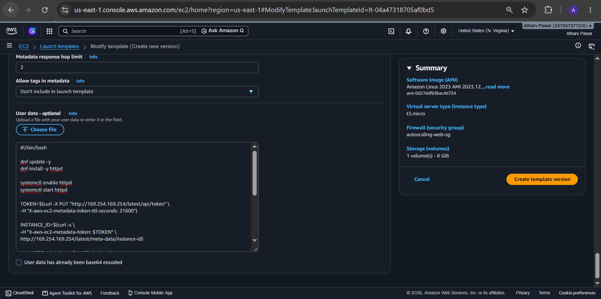

---

# 5. ⚙️ Auto Scaling Group

The Auto Scaling Group was configured as:

```text
Auto Scaling Group : autoscaling-web-asg
Launch Template    : autoscaling-web-template
```

The ASG is responsible for:

- Launching EC2 instances from the Launch Template.
- Maintaining the configured capacity.
- Replacing unhealthy instances when applicable.
- Increasing capacity when the scaling policy requires it.
- Decreasing capacity when the scaling policy requires it.

### Launch Template selection

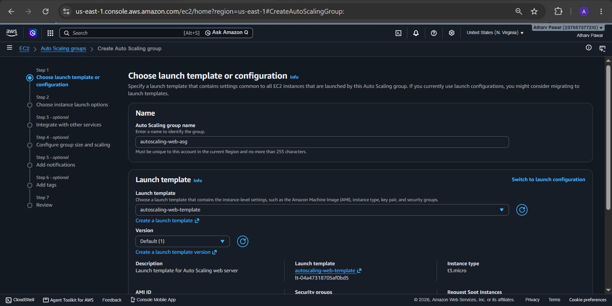

An additional Launch Template configuration capture is retained for reference:

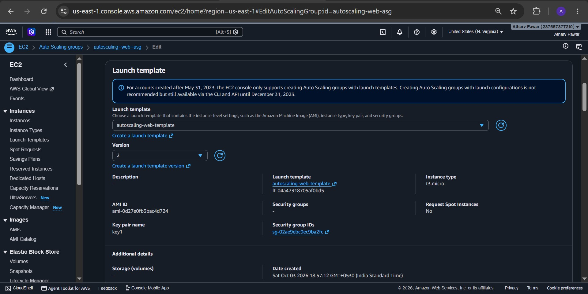

### Network configuration

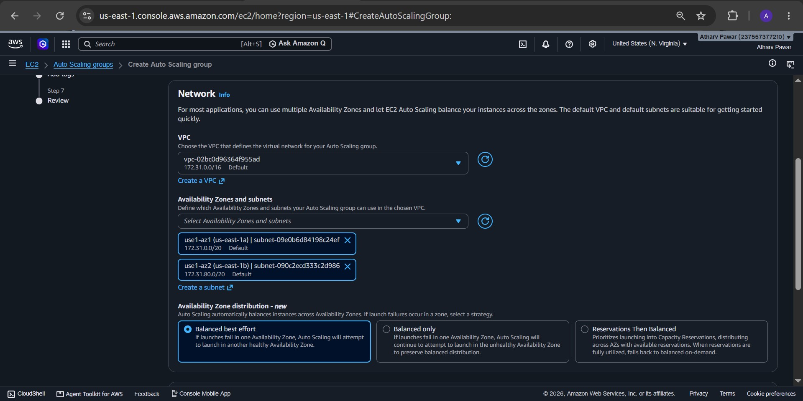

### ASG creation

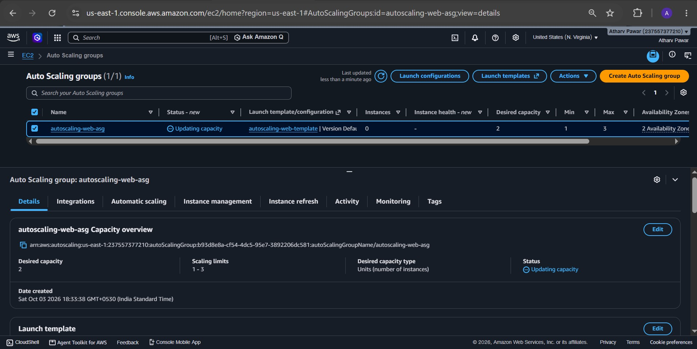

---

# 6. 📏 Capacity Configuration

The Auto Scaling Group was configured with:

| Capacity setting | Value |
|---|---:|
| Minimum | `1` |
| Desired | `2` |
| Maximum | `3` |

### Meaning

- **Minimum = 1:** ASG should not intentionally scale below one instance.
- **Desired = 2:** The configured initial/target capacity was two instances.
- **Maximum = 3:** The ASG can scale out to at most three instances under this configuration.

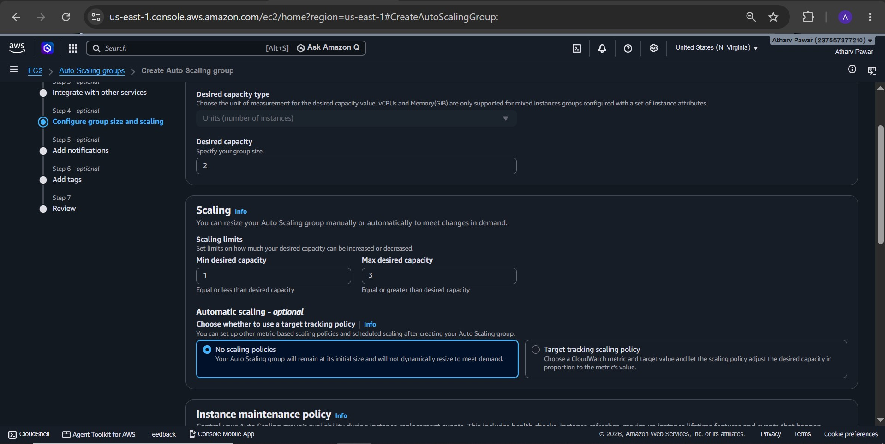

---

# 7. 📈 Target Tracking Scaling Policy

The project uses an **EC2 Target Tracking Scaling Policy**.

The captured configuration shows:

```text
Policy type      : Target Tracking
Metric           : Average CPU Utilization
Target value     : 50%
Instance warmup  : 300 seconds
Capacity limits  : 1–3 instances
```

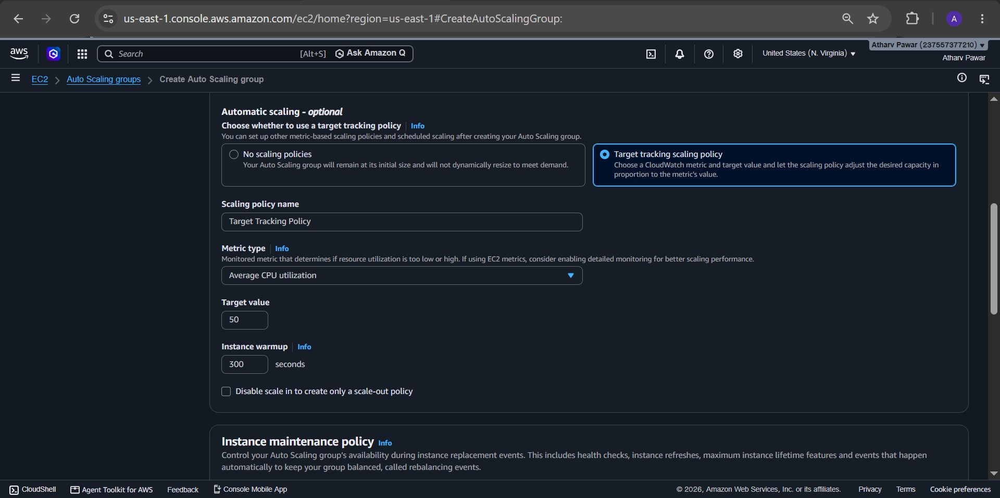

A second screenshot provides the scaling-policy configuration/evidence:

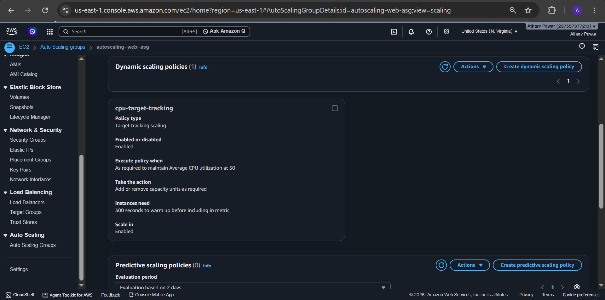

### Scaling concept

```text
CPU utilization rises
        ↓
Target Tracking evaluates the metric
        ↓
ASG increases desired capacity when required
        ↓
New EC2 instance launches
        ↓
User Data configures Apache automatically
```

When demand falls:

```text
CPU utilization falls
        ↓
Target Tracking evaluates the metric
        ↓
ASG can reduce excess capacity
        ↓
EC2 instance is terminated according to ASG behavior
```

> **Important:** Auto Scaling reactions are not instantaneous. Metric evaluation, policy behavior, instance warmup, and AWS-managed scaling processes introduce a delay between workload changes and capacity changes.

---

# 8. 🌐 Automatic Web Server Verification

Because Apache is installed through User Data, a newly launched instance can become a web server without manually installing Apache.

## Instance 1

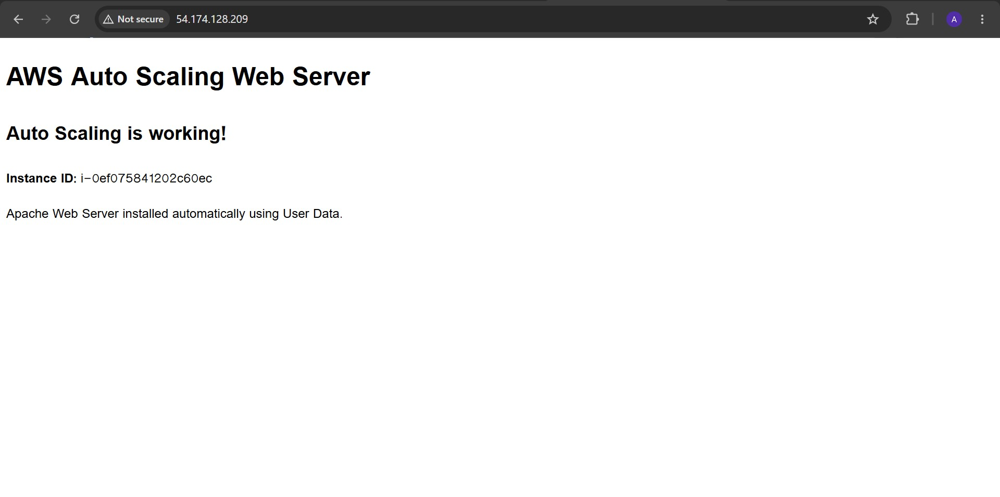

## Instance 2

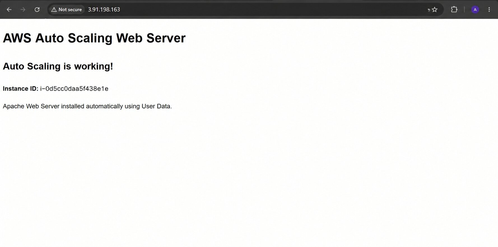

The two screenshots show the same application page structure while exposing different instance identities, providing evidence that the web server configuration was applied to individual EC2 instances.

---

# 9. 🧪 Scaling Demonstration

The scaling behavior was tested by generating CPU load and observing the EC2/Auto Scaling behavior.

## 9.1 Initial capacity

The environment was running with two EC2 instances.

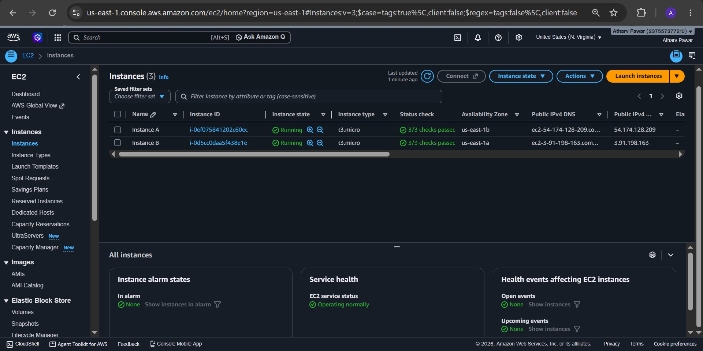

The ASG also showed two instances in service:

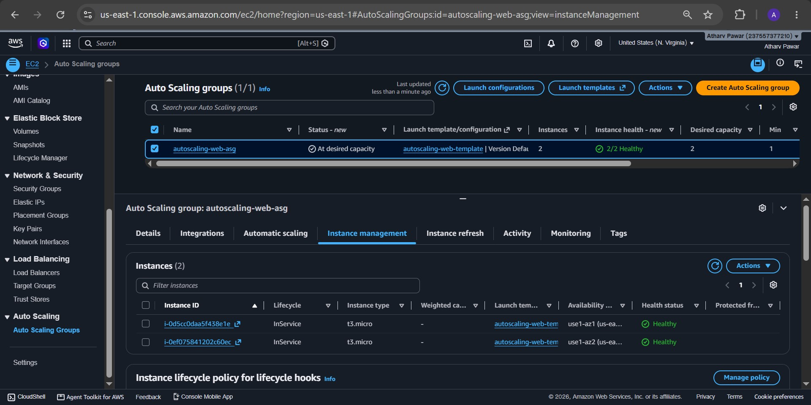

---

## 9.2 Generate CPU load

CPU load was generated using the `stress` utility:

```bash
sudo dnf install -y stress
stress --cpu 2 --timeout 600
```

The instance CPU utilization increased and was visible through the EC2/CloudWatch monitoring view.

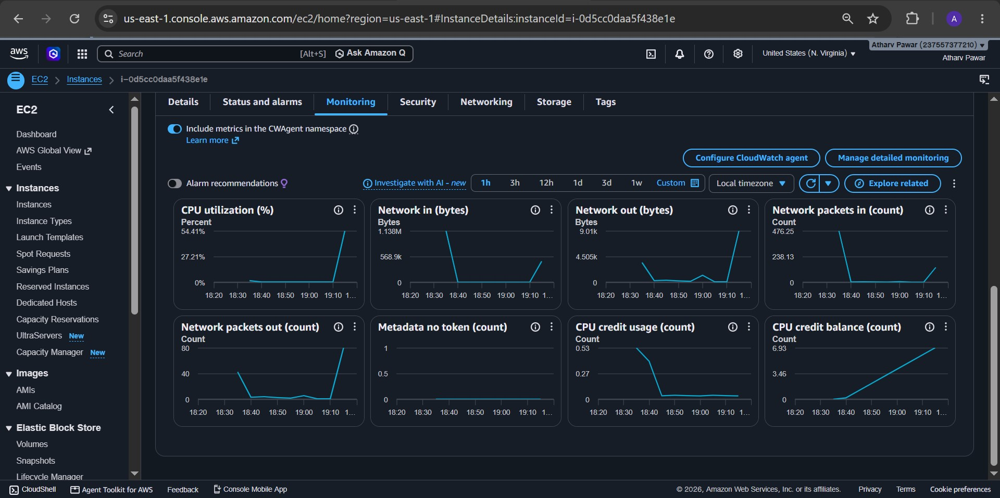

> The screenshot records a CPU utilization increase during the test. The exact value shown in the graph varies with the workload and observation interval.

---

## 9.3 Scale-out

The ASG subsequently reached three instances:

```text
Before : 2 instances
After  : 3 instances
```

The captured ASG view shows:

- Desired capacity: `3`
- Scaling limits: `1–3`
- Three instances
- Instances in `InService` state
- Healthy instance status

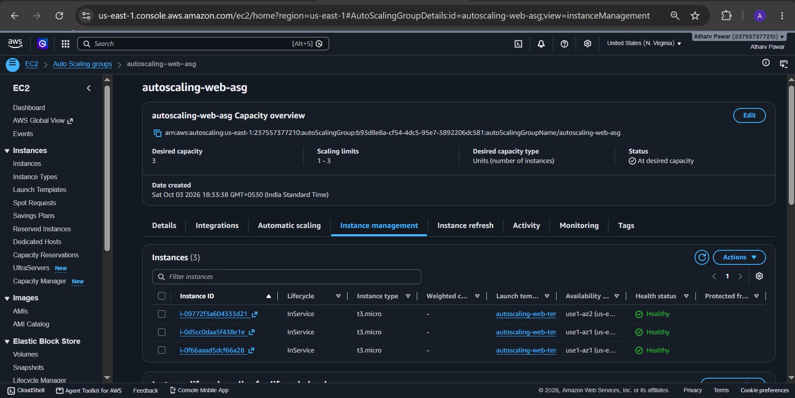

This demonstrates **horizontal scaling (scale-out)**.

---

## 9.4 Verify the newly launched instance

The third instance was launched by the Auto Scaling Group from the configured Launch Template.

Because the Launch Template contains User Data, Apache was automatically configured on the new instance.


This is an important part of the demonstration: scaling does not only create another EC2 instance; it creates an instance that receives the same automated bootstrap configuration.

---

## 9.5 Scale-in

After the workload was reduced, the ASG later showed:

```text
Desired capacity : 1
Scaling limits   : 1–3
Instances        : 1
```

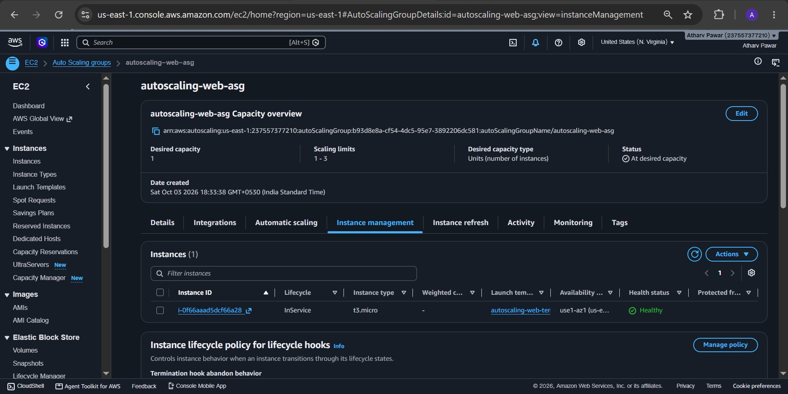

The filename `18-scale-in-2-instances.jpg` is retained from the original project repository; the screenshot itself shows the observed one-instance state.

### Final verification screenshot

The final captured ASG view is also retained:

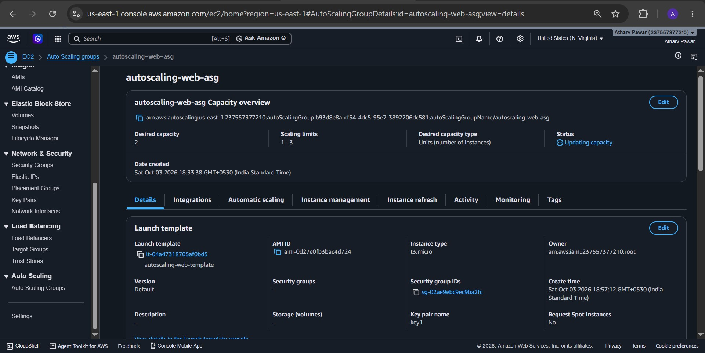

> This final screenshot was captured while the ASG console displayed **Desired capacity = 2** and an **Updating capacity** status. Therefore, it is treated as final implementation evidence rather than proof of a permanently settled capacity value.

---

# 10. 🔄 Observed Scaling Timeline

Based on the captured AWS Console evidence:

| Stage | Observed state |
|---|---|
| Initial test | 2 EC2 instances |
| CPU load generated | Elevated CPU utilization |
| Scale-out | 3 EC2 instances |
| New instance verification | Third instance served the Apache page |
| Scale-in | 1 EC2 instance / desired capacity shown as 1 |
| Final console capture | Desired capacity shown as 2 while capacity was updating |

This sequence demonstrates the intended **scale-out and scale-in behavior** while also preserving the actual state shown in each screenshot.

---

# 11. 🧠 Key AWS Concepts Demonstrated

## Horizontal Scaling

The application scales by changing the **number of EC2 instances**, rather than increasing the size of one existing instance.

```text
Scale Out:
2 EC2 → 3 EC2

Scale In:
3 EC2 → fewer EC2 instances
```

## Infrastructure Automation

The combination of Launch Template + User Data provides repeatable instance provisioning:

```text
Launch Template
      ↓
New EC2 Instance
      ↓
User Data executes
      ↓
Apache installed
      ↓
Instance ID inserted into page
      ↓
Web server available
```

## Metric-Based Scaling

The Target Tracking policy uses CPU utilization as the scaling signal:

```text
Average CPU Utilization
          ↓
Target Tracking Policy
          ↓
Adjust ASG Desired Capacity
```

---

# 12. 📁 Repository Structure

```text
AWS-Auto-Scaling-Web-Server/
│
├── README.md
│
└── screenshots/
    ├── 01-aws-region.jpg
    ├── 02-security-group.jpg
    ├── 03-user-data.jpg
    ├── 03-user-data-v2.jpg
    ├── 04-launch-template.jpg
    ├── 05-asg-launch-template.jpg
    ├── 05-asg-launch-template-v2.jpg
    ├── 06-asg-network.jpg
    ├── 07-asg-capacity.jpg
    ├── 08-scaling-policy.jpg
    ├── 09-asg-created.jpg
    ├── 10-two-ec2-instances.jpg
    ├── 11-web-server-instance-1.jpg
    ├── 12-web-server-instance-2.jpg
    ├── 13-asg-two-inservice.jpg
    ├── 14-scaling-policy.jpg
    ├── 15-high-cpu-cloudwatch.jpg
    ├── 16-scale-out-3-instances.jpg
    ├── 17-third-instance-web-server.jpg
    ├── 18-scale-in-2-instances.jpg
    └── 19-final-asg-verification.jpg
```

---

# 13. ✅ Requirement Validation

| Requirement | Evidence / Implementation |
|---|---|
| EC2 Launch Template | `autoscaling-web-template` |
| Auto Scaling Group | `autoscaling-web-asg` |
| Minimum capacity | `1` |
| Desired capacity | `2` configured initially |
| Maximum capacity | `3` |
| Automatic web-server deployment | EC2 User Data + Apache |
| Monitoring metric | Average CPU Utilization |
| Scaling policy | Target Tracking |
| CPU target | `50%` |
| Scale-out | 2 → 3 instances observed |
| New instance configuration | Third instance served Apache page |
| Scale-in | Reduced capacity observed |
| Screenshots | 19 primary/additional evidence images retained |

---

# 14. 🔐 Security and Production Considerations

This repository demonstrates an AWS learning/test environment. A production architecture should additionally consider:

- **Least-privilege IAM:** use narrowly scoped IAM roles and policies.
- **Network isolation:** place application instances in appropriate private subnets where possible.
- **Restricted ingress:** allow only required ports and trusted sources.
- **HTTPS:** use TLS for production web traffic.
- **Application Load Balancer:** place an ALB in front of the ASG when a stable application endpoint and traffic distribution are required.
- **Secrets management:** use AWS Secrets Manager or Systems Manager Parameter Store instead of hard-coding credentials.
- **Centralized logging:** collect application/system logs for troubleshooting and auditing.
- **CloudWatch alarms:** configure operational alarms in addition to scaling policies.
- **Launch Template versioning:** use controlled versions for repeatable deployments.
- **Instance metadata security:** keep IMDSv2 enabled where appropriate.

### Why an Application Load Balancer is not included

The project requirement is centered on:

```text
Launch Template
      +
Auto Scaling Group
      +
CloudWatch / Target Tracking
      +
Automatically deployed web server
```

Therefore, the current implementation verifies the EC2 web servers directly rather than adding an Application Load Balancer as another infrastructure component.

---

# 15. 💰 AWS Cost and Cleanup

AWS resources may incur charges depending on account, region, resource type, and usage.

After completing the demonstration, remove resources that are no longer required.

Typical cleanup:

1. Reduce/delete the Auto Scaling Group when the project is finished.
2. Delete the Launch Template if it is no longer required.
3. Remove unused security groups and other test resources when safe.
4. Verify that no unwanted EC2/EBS resources remain.
5. Review the AWS Billing/Cost Management console.

> **Warning:** Changing or deleting an Auto Scaling Group can terminate managed EC2 instances depending on the selected options. Collect your screenshots and project evidence before cleanup.

---

# 16. 🧹 Reproduction Guide

The following is the high-level sequence used to reproduce the project:

### Step 1 — Select the AWS region

Use:

```text
us-east-1
```

### Step 2 — Create the security group

Create:

```text
autoscaling-web-sg
```

Allow the HTTP access required for testing.

### Step 3 — Create the Launch Template

Configure:

```text
Name          : autoscaling-web-template
AMI           : Amazon Linux 2023
Instance type : t3.micro
Security group: autoscaling-web-sg
User Data     : Apache installation + instance ID page
```

### Step 4 — Create the Auto Scaling Group

Use the Launch Template and configure:

```text
Minimum capacity : 1
Desired capacity : 2
Maximum capacity : 3
```

### Step 5 — Configure Target Tracking

Use:

```text
Metric       : Average CPU Utilization
Target       : 50%
Warmup       : 300 seconds
```

### Step 6 — Verify web-server provisioning

Open the web page served by the EC2 instance and verify that the page displays the instance ID.

### Step 7 — Generate CPU load

For testing:

```bash
sudo dnf install -y stress
stress --cpu 2 --timeout 600
```

### Step 8 — Observe scaling

Monitor:

- EC2 CPU utilization.
- Auto Scaling Group desired capacity.
- Number of `InService` instances.
- Instance health.
- Newly launched instance web-server availability.

### Step 9 — Stop the load

After the test, stop the workload and allow the Auto Scaling policy to respond to the lower utilization.

---

# 17. 📚 Official AWS Documentation

- [Amazon EC2 Auto Scaling](https://docs.aws.amazon.com/autoscaling/ec2/userguide/what-is-amazon-ec2-auto-scaling.html)
- [EC2 Launch Templates](https://docs.aws.amazon.com/AWSEC2/latest/UserGuide/ec2-launch-templates.html)
- [Target Tracking Scaling Policies](https://docs.aws.amazon.com/autoscaling/ec2/userguide/as-scaling-target-tracking.html)
- [EC2 User Data](https://docs.aws.amazon.com/AWSEC2/latest/UserGuide/user-data.html)
- [Amazon CloudWatch](https://docs.aws.amazon.com/AmazonCloudWatch/latest/monitoring/WhatIsCloudWatch.html)
- [EC2 Instance Metadata Service](https://docs.aws.amazon.com/AWSEC2/latest/UserGuide/ec2-instance-metadata.html)

---

# 18. 🏁 Conclusion

This project demonstrates an end-to-end **AWS EC2 Auto Scaling web-server environment** using:

- EC2 Launch Template
- EC2 Auto Scaling Group
- Amazon Linux 2023
- Apache HTTP Server
- EC2 User Data
- CloudWatch CPU metrics
- Target Tracking Scaling Policy
- Horizontal scale-out
- Horizontal scale-in

The captured AWS Console evidence shows the infrastructure configuration, automated web-server deployment, elevated CPU monitoring, scale-out to three instances, verification of the newly launched web server, and subsequent scale-in behavior.

---

## 👨‍💻 Project Summary

```text
Project        : AWS EC2 Auto Scaling Web Server
Region         : us-east-1
Launch Template: autoscaling-web-template
ASG            : autoscaling-web-asg
AMI            : Amazon Linux 2023
Instance Type  : t3.micro
Web Server     : Apache HTTP Server
Metric         : Average CPU Utilization
Target         : 50%
Min Capacity   : 1
Desired        : 2
Max Capacity   : 3
Warmup         : 300 seconds
```

<p align="center">
  <b>EC2 Launch Template → Auto Scaling Group → CloudWatch Target Tracking → Scale-Out / Scale-In</b>
</p>
