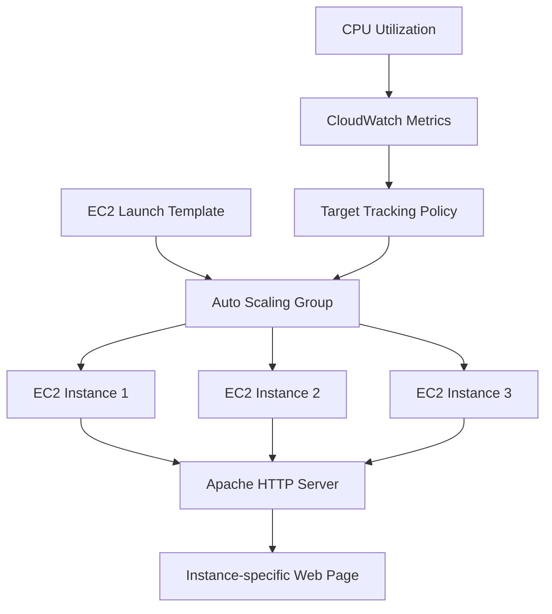

# 🚀 AWS EC2 Auto Scaling Web Server

> A hands-on AWS project demonstrating automated EC2 provisioning, Apache web-server deployment, and CPU-based horizontal scaling using an EC2 Launch Template, Auto Scaling Group, and CloudWatch-backed Target Tracking.

[](https://aws.amazon.com/ec2/)
[](https://aws.amazon.com/cloudwatch/)
[](https://httpd.apache.org/)

---

## 📌 Project Overview

This project implements a small, self-managing web-server environment on **Amazon Web Services (AWS)**.

An **EC2 Launch Template** defines how new instances are created. An **Auto Scaling Group (ASG)** uses that template to maintain the required number of healthy EC2 instances. A **Target Tracking Scaling Policy** monitors average CPU utilization and automatically adjusts the number of instances within the configured capacity limits.

Each EC2 instance installs **Apache HTTP Server automatically through EC2 User Data**. The generated web page displays the instance ID, which makes it easy to verify that different EC2 instances are being launched and serving the application.

### Project objectives

- Create an EC2 Launch Template.
- Configure an Auto Scaling Group.
- Set minimum, desired, and maximum capacity.
- Automatically install and start Apache on new instances.
- Use CPU utilization as the scaling signal.
- Demonstrate **scale-out** under high CPU load.
- Demonstrate **scale-in** after CPU load is removed.
- Verify that newly launched instances automatically serve the web page.

---

## 🏗️ Architecture



### Scaling flow

```text
                 CPU Utilization
                        │
                        ▼
                CloudWatch Metrics
                        │
                        ▼
             Target Tracking Policy
                        │
          ┌─────────────┴─────────────┐
          │                           │
     CPU increases               CPU decreases
          │                           │
          ▼                           ▼
      Scale Out                   Scale In
          │                           │
          ▼                           ▼
   Launch instances            Remove instances
```

> **Note:** The project uses an Auto Scaling Target Tracking policy. AWS continuously evaluates the selected metric and adjusts ASG capacity toward the configured target, subject to the minimum and maximum capacity limits.

---

## ☁️ AWS Services & Components

| Component | Purpose |
|---|---|
| **Amazon EC2** | Runs the web-server instances |
| **EC2 Launch Template** | Defines the configuration used to launch EC2 instances |
| **EC2 Auto Scaling Group** | Maintains and adjusts the desired number of instances |
| **Amazon CloudWatch** | Provides CPU utilization metrics used by the scaling mechanism |
| **Target Tracking Policy** | Adjusts capacity toward the configured CPU target |
| **Security Group** | Controls network access to the EC2 instances |
| **Apache HTTP Server** | Serves the web page |
| **EC2 User Data** | Automates software installation and initial server configuration |

---

## 🌎 AWS Region

The project was implemented in:

```text
Region Name : US East (N. Virginia)
Region Code : us-east-1
```


---

# 1. 🔐 Security Group

A security group named:

```text
autoscaling-web-sg
```

was used for the web-server environment.

The security group was configured to permit HTTP access so that the Apache web server could be tested from a browser.


> **Security note:** For a production environment, inbound rules should be restricted to the minimum required sources. Avoid opening SSH (`22`) to `0.0.0.0/0` unless there is a specific reason to do so.

---

# 2. 🚀 EC2 Launch Template

The Launch Template is the reusable instance definition used by the Auto Scaling Group.

### Launch Template

```text
autoscaling-web-template
```

The template contains the configuration required to create a web-server instance, including:

- AMI
- Instance type
- Key pair
- Network/security configuration
- EC2 User Data
- Other instance launch settings

The project used a `t3.micro` instance type.


---

# 3. 📝 EC2 User Data

EC2 User Data is used to bootstrap every newly launched instance automatically.

The startup script:

1. Updates installed packages.
2. Installs Apache HTTP Server.
3. Enables Apache to start automatically at boot.
4. Starts the Apache service.
5. Retrieves the EC2 Instance ID using **IMDSv2**.
6. Generates an HTML page containing the instance ID.

### User Data script

```bash
#!/bin/bash

dnf update -y
dnf install -y httpd

systemctl enable httpd
systemctl start httpd

TOKEN=$(curl -X PUT "http://169.254.169.254/latest/api/token" \
-H "X-aws-ec2-metadata-token-ttl-seconds: 21600")

INSTANCE_ID=$(curl -s \
-H "X-aws-ec2-metadata-token: $TOKEN" \
http://169.254.169.254/latest/meta-data/instance-id)

cat <<EOF > /var/www/html/index.html
<!DOCTYPE html>
<html>
<head>
    <title>AWS Auto Scaling Web Server</title>
</head>
<body>
    <h1>AWS Auto Scaling Web Server</h1>
    <h2>Auto Scaling is working!</h2>
    <p><strong>Instance ID:</strong> $INSTANCE_ID</p>
    <p>Apache Web Server installed automatically using User Data.</p>
</body>
</html>
EOF
```

### Why IMDSv2?

The script uses the EC2 Instance Metadata Service v2 token flow instead of directly requesting metadata without a token. This is the recommended metadata access approach when IMDSv2 is enabled.


---

# 4. ⚙️ Auto Scaling Group

The Auto Scaling Group was created using the Launch Template:

```text
Auto Scaling Group : autoscaling-web-asg
Launch Template    : autoscaling-web-template
```

The ASG is responsible for:

- Launching instances from the Launch Template.
- Maintaining the configured capacity.
- Replacing unhealthy instances when required.
- Increasing capacity when the scaling policy requires it.
- Decreasing capacity when the scaling policy requires it.

### Launch Template configuration


### Network configuration


### ASG created


---

# 5. 📊 Capacity Configuration

The Auto Scaling Group was configured with the following capacity limits:

| Setting | Value |
|---|---:|
| **Minimum capacity** | `1` |
| **Desired capacity** | `2` |
| **Maximum capacity** | `3` |

This means:

- The ASG should maintain **at least 1 instance**.
- The initial/target capacity for the test was **2 instances**.
- The ASG can automatically increase to a maximum of **3 instances**.


---

# 6. 📈 Target Tracking Scaling Policy

A **Target Tracking Scaling Policy** was configured using average EC2 CPU utilization.

```text
Metric      : Average CPU Utilization
Target      : 50%
Minimum     : 1 instance
Maximum     : 3 instances
```

The target tracking policy attempts to keep average CPU utilization close to the configured target by adjusting the ASG capacity.

### Expected behavior

```text
CPU utilization increases
        ↓
Target Tracking detects increased demand
        ↓
ASG launches additional instance(s)
        ↓
CPU load is distributed across more capacity
```

And when demand decreases:

```text
CPU utilization decreases
        ↓
Target Tracking detects lower demand
        ↓
ASG can terminate excess capacity
        ↓
Capacity moves toward the configured target
```


> **Important:** Scaling is not necessarily instantaneous. Auto Scaling evaluates metrics and uses AWS-managed scaling behavior, so there can be a delay between a change in CPU utilization and an instance launch/termination.

---

# 7. 🌐 Web Server Verification

Because Apache is installed through User Data, every EC2 instance launched from the Launch Template should automatically become a web server after initialization completes.

The generated page contains the instance ID.

This makes the instance identity visible during testing and provides a simple way to confirm that different instances were created from the same Launch Template.

### Instance 1


### Instance 2


---

# 8. 🧪 Auto Scaling Test

The scaling behavior was tested by increasing CPU utilization and observing the ASG response.

## Step 1 — Initial state

The ASG started with:

```text
Minimum  = 1
Desired  = 2
Maximum  = 3
```

Two EC2 instances were initially running.


---

## Step 2 — Generate CPU load

CPU load was generated on an EC2 instance using the `stress` utility.

```bash
sudo dnf install -y stress
stress --cpu 2 --timeout 600
```

The CPU utilization increased and became visible through CloudWatch monitoring.


---

## Step 3 — Scale-out

As the workload increased, the Target Tracking policy responded by increasing the Auto Scaling Group capacity.

```text
Before: 2 instances
After : 3 instances
```


This demonstrates **horizontal scaling**, where additional EC2 instances are launched instead of increasing the size of an existing instance.

---

## Step 4 — Verify the newly launched instance

The third instance was created automatically by the Auto Scaling Group using the Launch Template.

Because the Launch Template contains the User Data script, Apache was installed automatically on the new instance.

The generated web page was then verified from the new instance.


---

## Step 5 — Stop the CPU load

After the CPU stress test was stopped, CPU utilization decreased.

The ASG then reduced capacity according to the Target Tracking policy and configured minimum capacity.

The observed environment returned to a single healthy instance:

```text
3 instances
      ↓
Scale-In
      ↓
1 instance
```


> The screenshot filename is retained from the original project, but the AWS console shown in the screenshot reports **Desired capacity = 1** and **one InService instance**.

---

# 9. 🔄 Scaling Behavior Summary

```text
                    INITIAL STATE
                         │
                         ▼
                  2 EC2 Instances
                         │
                         │ High CPU Load
                         ▼
                 CloudWatch Metrics
                         │
                         ▼
              Target Tracking Policy
                         │
                         ▼
                    SCALE OUT
                         │
                         ▼
                  3 EC2 Instances
                         │
                         │ CPU Load Stopped
                         ▼
                 CPU Utilization ↓
                         │
                         ▼
              Target Tracking Policy
                         │
                         ▼
                    SCALE IN
                         │
                         ▼
                   1 EC2 Instance
```

### Observed result

| Test stage | Observed capacity |
|---|---:|
| Initial state | 2 |
| High CPU / scale-out | 3 |
| After load reduction / scale-in | 1 |

This demonstrates both directions of horizontal scaling within the configured limits.

---

# 10. 📸 Complete Implementation Evidence

### AWS Region


### Security Group


### User Data


### Launch Template


### ASG — Launch Template


### ASG — Network


### ASG — Capacity


### Scaling Policy


### ASG Created


### Two EC2 Instances


### Web Server — Instance 1


### Web Server — Instance 2


### Two In-Service Instances


### Scaling Policy Verification


### High CPU CloudWatch Metrics


### Scale-Out — 3 Instances


### Third Instance Web Server


### Scale-In


### Final ASG Verification


---

# 11. 📁 Project Structure

```text
AWS-Auto-Scaling-Web-Server/
│
├── README.md
│
└── screenshots/
    ├── 01-aws-region.jpg
    ├── 02-security-group.jpg
    ├── 03-user-data.jpg
    ├── 03-user-data-v2.jpg
    ├── 04-launch-template.jpg
    ├── 05-asg-launch-template.jpg
    ├── 05-asg-launch-template-v2.jpg
    ├── 06-asg-network.jpg
    ├── 07-asg-capacity.jpg
    ├── 08-scaling-policy.jpg
    ├── 09-asg-created.jpg
    ├── 10-two-ec2-instances.jpg
    ├── 11-web-server-instance-1.jpg
    ├── 12-web-server-instance-2.jpg
    ├── 13-asg-two-inservice.jpg
    ├── 14-scaling-policy.jpg
    ├── 15-high-cpu-cloudwatch.jpg
    ├── 16-scale-out-3-instances.jpg
    ├── 17-third-instance-web-server.jpg
    ├── 18-scale-in-2-instances.jpg
    └── 19-final-asg-verification.jpg
```

> The `*-v2.jpg` screenshots are retained in the repository as supporting evidence. The main README references the primary screenshots to keep the documentation clean and avoid duplicate evidence.

---

# 12. ✅ Validation Checklist

| Requirement | Status |
|---|:---:|
| EC2 Launch Template created | ✅ |
| Auto Scaling Group created | ✅ |
| Minimum capacity configured | ✅ |
| Desired capacity configured | ✅ |
| Maximum capacity configured | ✅ |
| Apache installed automatically | ✅ |
| EC2 User Data configured | ✅ |
| Instance ID displayed on web page | ✅ |
| Target Tracking policy configured | ✅ |
| CloudWatch CPU metrics observed | ✅ |
| CPU load generated for testing | ✅ |
| Scale-out demonstrated | ✅ |
| Third instance launched automatically | ✅ |
| New instance web server verified | ✅ |
| Scale-in demonstrated | ✅ |
| Final ASG state verified | ✅ |

---

# 13. 🔐 Security & Production Considerations

This project is designed as an AWS learning/demo environment. A production implementation should additionally consider:

- Use the **principle of least privilege** for IAM permissions.
- Restrict security-group ingress to trusted sources.
- Avoid exposing SSH to the entire internet.
- Prefer **private subnets** for application instances where appropriate.
- Use an **Application Load Balancer (ALB)** for a stable application endpoint and traffic distribution.
- Use **HTTPS/TLS** for production web traffic.
- Store secrets in **AWS Secrets Manager** or **AWS Systems Manager Parameter Store** instead of hard-coding them.
- Consider **IAM roles for EC2** rather than long-lived access keys.
- Add centralized logging and monitoring.
- Define appropriate CloudWatch alarms for operational visibility.
- Use immutable/versioned Launch Templates for controlled deployments.

### Why an Application Load Balancer is not included here

This project focuses specifically on the requested:

```text
Launch Template
        +
Auto Scaling Group
        +
CloudWatch / Target Tracking
        +
Automatically deployed web server
```

The web server is therefore tested directly through the EC2 instance public address. In a production architecture, an **Application Load Balancer** would normally be placed in front of the ASG so users do not need to know individual instance addresses.

---

# 14. 🧹 Cleanup / Cost Control

AWS resources can incur charges depending on account configuration and usage.

After completing the demonstration, clean up resources that are no longer required:

1. Reduce or delete the Auto Scaling Group.
2. Delete the Launch Template if it is no longer needed.
3. Remove unused security groups.
4. Remove other resources created specifically for the test.
5. Verify the EC2 console and billing dashboard to ensure no unwanted resources remain.

> **Important:** Deleting or reducing an Auto Scaling Group can terminate its managed EC2 instances depending on the selected options. Perform cleanup only after you have finished collecting project evidence.

---

# 15. 🎯 Key Concepts Demonstrated

### Horizontal Scaling

Instead of upgrading one EC2 instance to a larger instance type, the application scales by adding or removing instances.

```text
2 instances
     ↓
3 instances
```

This is called **horizontal scaling** (scale-out).

### Infrastructure Automation

The Launch Template + User Data combination allows every new EC2 instance to be configured automatically.

```text
Launch Template
      ↓
New EC2 Instance
      ↓
User Data
      ↓
Apache Installation
      ↓
Web Page Available
```

### Self-Adjusting Capacity

The Auto Scaling Group uses a Target Tracking policy to adjust capacity according to CPU utilization.

```text
High CPU  → Scale Out
Low CPU   → Scale In
```

---

# 16. 🏁 Final Result

The project successfully demonstrates an automated and scalable EC2 web-server environment.

### Final configuration

```text
AWS Region
└── us-east-1

Launch Template
└── autoscaling-web-template

Auto Scaling Group
└── autoscaling-web-asg

Capacity
├── Minimum  = 1
├── Desired  = 2
└── Maximum  = 3

Scaling Policy
└── Target Tracking
    └── Average CPU Utilization = 50%

Web Server
└── Apache HTTP Server
```

### Demonstrated behavior

```text
                    ┌───────────────────┐
                    │  Initial Capacity │
                    │   2 Instances     │
                    └─────────┬─────────┘
                              │
                         High CPU Load
                              │
                              ▼
                    ┌───────────────────┐
                    │    Scale-Out      │
                    │   3 Instances     │
                    └─────────┬─────────┘
                              │
                       Load Removed
                              │
                              ▼
                    ┌───────────────────┐
                    │     Scale-In      │
                    │   1 Instance      │
                    └───────────────────┘
```

The implementation validates the complete workflow required for an EC2 Auto Scaling environment:

**Launch Template → Automated Web Server Deployment → Auto Scaling Group → CloudWatch CPU Metrics → Scale-Out → Scale-In**

---

## 👨‍💻 Project Information

| Property | Value |
|---|---|
| **Project** | AWS EC2 Auto Scaling Web Server |
| **AWS Region** | `us-east-1` |
| **Launch Template** | `autoscaling-web-template` |
| **Auto Scaling Group** | `autoscaling-web-asg` |
| **Instance Type** | `t3.micro` |
| **Web Server** | Apache HTTP Server |
| **Scaling Method** | Target Tracking |
| **Scaling Metric** | Average CPU Utilization |
| **Target Value** | `50%` |
| **Minimum Capacity** | `1` |
| **Desired Capacity** | `2` |
| **Maximum Capacity** | `3` |

---

## 📚 AWS Documentation

- [Amazon EC2 Auto Scaling](https://docs.aws.amazon.com/autoscaling/ec2/userguide/what-is-amazon-ec2-auto-scaling.html)
- [EC2 Launch Templates](https://docs.aws.amazon.com/AWSEC2/latest/UserGuide/ec2-launch-templates.html)
- [Target Tracking Scaling Policies](https://docs.aws.amazon.com/autoscaling/ec2/userguide/as-scaling-target-tracking.html)
- [EC2 User Data](https://docs.aws.amazon.com/AWSEC2/latest/UserGuide/user-data.html)
- [Amazon CloudWatch](https://docs.aws.amazon.com/AmazonCloudWatch/latest/monitoring/WhatIsCloudWatch.html)
- [EC2 Instance Metadata Service](https://docs.aws.amazon.com/AWSEC2/latest/UserGuide/ec2-instance-metadata.html)

---

<p align="center">
  <b>Built as an AWS hands-on project to demonstrate automated provisioning, monitoring, and horizontal scaling.</b>
</p>
